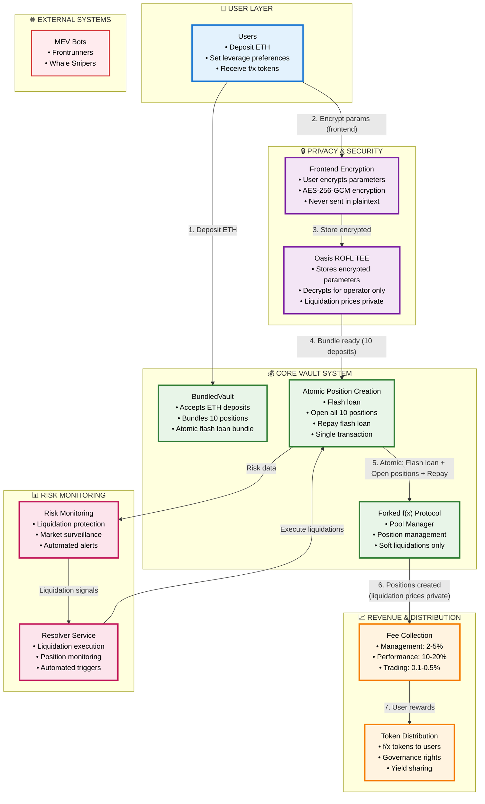
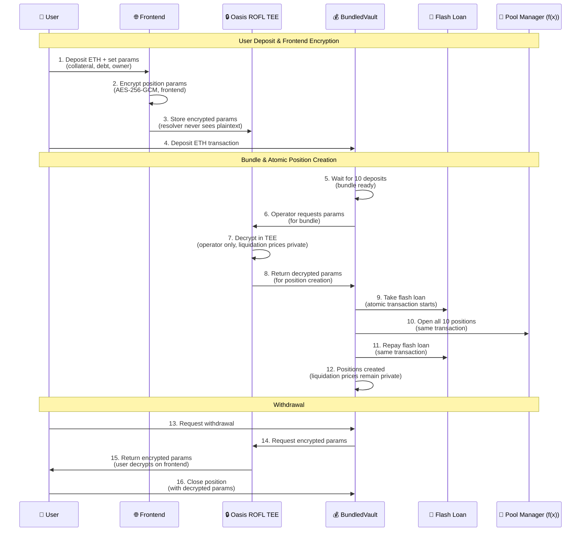
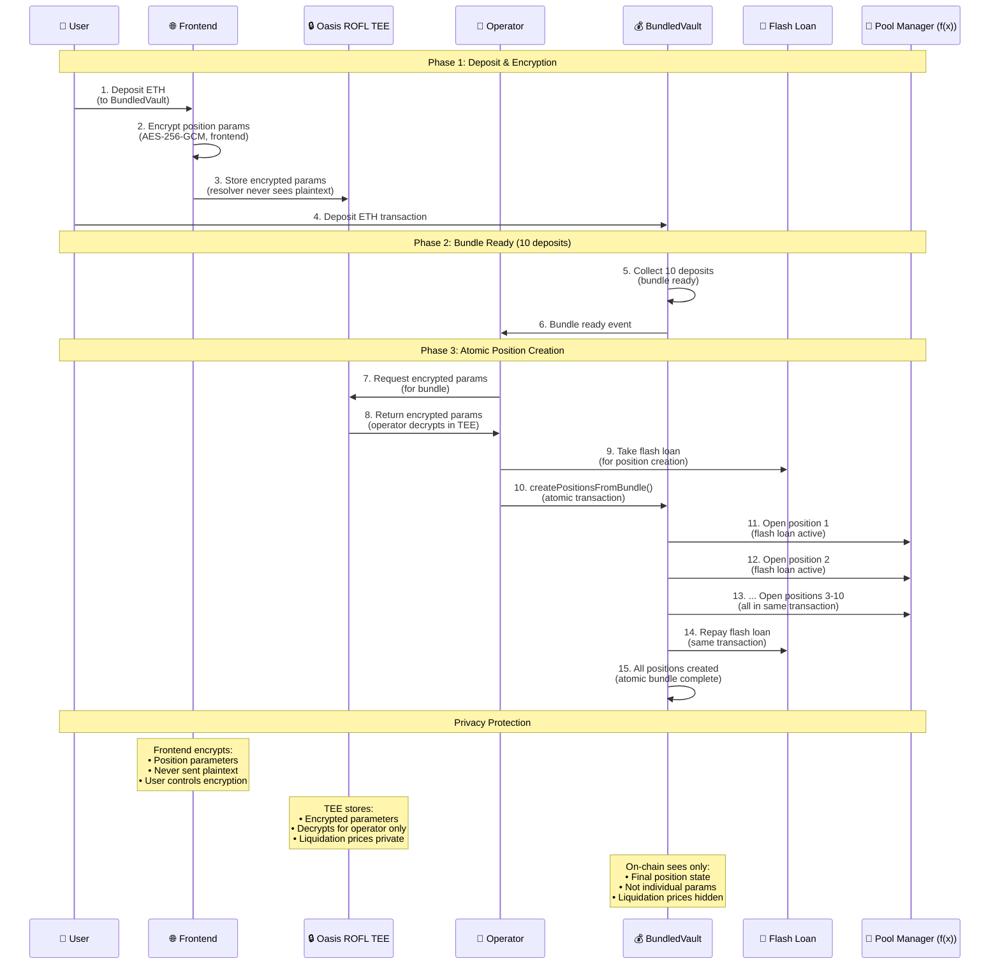
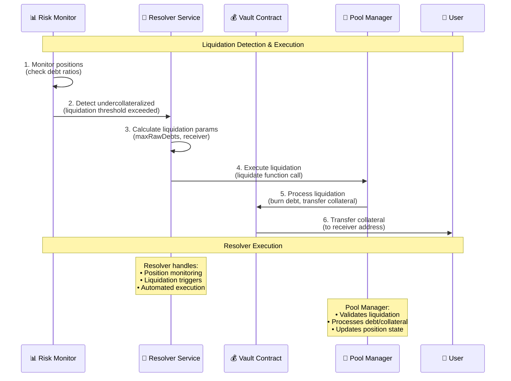

# Shayd: Privacy-First Leveraged Trading/Yield Generation Platform (v2.0)

## System Architecture

## Technical Flow Breakdown

## Position Creation & Atomic Bundling

## Liquidation Flow with Resolver

## Architecture Details

```mermaid
graph LR
    subgraph USER["👤 USER SIDE"]
        A["User Input<br/>Position params:<br/>• Collateral amount<br/>• Debt amount<br/>• Owner address"]
        B["Ethers.js Wallet<br/>Sign transaction<br/>Submit to TEE<br/>Submit to contract"]
    end
    
    subgraph TEE["🔒 OASIS ROFL TEE"]
        C["Encrypted Storage<br/>Store encrypted params<br/>Decrypt for operator only<br/>Liquidation prices private"]
    end
    
    subgraph ONCHAIN["⛓️ ON-CHAIN EXECUTION"]
        D["BundledVault<br/>Accept deposits<br/>Bundle 10 positions<br/>Atomic flash loan bundle"]
        E["Pool Manager (f(x))<br/>Position operations<br/>Debt/collateral management<br/>Soft liquidations"]
    end
    
    subgraph RESOLVER["🔧 RESOLVER SERVICE"]
        F["Position Monitoring<br/>Monitor debt ratios<br/>Detect liquidations"]
        G["Liquidation Execution<br/>Calculate params<br/>Execute liquidations"]
    end
    
    subgraph MONITORING["📊 RISK MONITORING"]
        H["Risk Monitor<br/>Market surveillance<br/>Automated alerts"]
    end
    
    %% Main flow
    A -->|"1. Deposit ETH"| D
    A -->|"2. Encrypt params"| B
    B -->|"3. Store encrypted"| C
    C -->|"4. Bundle ready"| D
    D -->|"5. Atomic flash loan bundle"| E
    
    %% Monitoring flow
    E -->|"5"| H
    H -->|"6"| F
    F -->|"7"| G
    G -->|"8"| E
    
    %% Styling
    classDef userStyle fill:#e3f2fd,stroke:#1976d2,stroke-width:3px,color:#000
    classDef teeStyle fill:#f3e5f5,stroke:#7b1fa2,stroke-width:3px,color:#000
    classDef onchainStyle fill:#fff3e0,stroke:#f57c00,stroke-width:3px,color:#000
    classDef resolverStyle fill:#e8f5e8,stroke:#2e7d32,stroke-width:3px,color:#000
    classDef monitoringStyle fill:#fce4ec,stroke:#c2185b,stroke-width:3px,color:#000
    
    class A,B userStyle
    class C teeStyle
    class D,E onchainStyle
    class F,G resolverStyle
    class H monitoringStyle
```

## Core Concept

**Shayd** implements a privacy-first leveraged trading/yield generation platform using Oasis ROFL TEE for secure parameter hashing and a dedicated resolver service for automated liquidations.

### Key Innovation: Frontend Encryption + Atomic Bundling

**Problem**: Position parameters (collateral, debt, owner) reveal liquidation prices, making positions vulnerable to MEV extraction.

**Solution**: Privacy-first architecture:
1. **Frontend Encryption**: Users encrypt position parameters before sending to resolver
2. **TEE Storage**: Encrypted parameters stored in TEE, resolver never sees plaintext
3. **Atomic Bundling**: Flash loan + Open all 10 positions + Repay in single transaction
4. **Liquidation Prices Private**: Only TEE knows position parameters; on-chain only sees final state
5. **Soft Liquidations**: Positions can be partially liquidated, no hard liquidations

### Technical Implementation

**Architecture Layers**:
- **Frontend Layer**: User-side encryption (AES-256-GCM) before sending to resolver
- **TEE Layer**: Oasis ROFL TEE for encrypted parameter storage and operator decryption
- **Vault Core**: BundledVault with atomic flash loan bundling (forked f(x) protocol)
- **Resolver Layer**: Automated soft liquidation execution and position monitoring
- **Monitoring Layer**: Risk management and position monitoring

**Key Technical Features**:
- **Frontend Encryption**: Position parameters encrypted before leaving user's device
- **Atomic Bundling**: Flash loan + position opening + repayment in single transaction
- **Privacy Protection**: Liquidation prices only known to TEE, on-chain sees final state only
- **Forked f(x) Protocol**: Direct fork with soft liquidation support
- **No Hard Liquidations**: Positions can be partially liquidated to restore health

### Position Parameter Encryption

Position parameters that are encrypted on the frontend include:
- **Collateral Amount**: The amount of collateral tokens
- **Debt Amount**: The amount of debt tokens
- **Owner Address**: The address of the position owner
- **Position ID**: The unique identifier for the position

The frontend encrypts these parameters using AES-256-GCM before sending to the resolver. The TEE stores encrypted parameters and only decrypts for the operator when creating positions. This ensures liquidation prices remain private until after the atomic bundle transaction completes.

### Soft Liquidation Execution

Soft liquidations are executed by the resolver service located in the `resolver/` folder:
- **Position Monitoring**: Continuously monitors position debt ratios
- **Liquidation Detection**: Identifies undercollateralized positions
- **Automated Execution**: Executes soft liquidations via Pool Manager contract (forked f(x))
- **Partial Liquidation**: Positions are partially liquidated to restore health, never fully closed
- **No Hard Liquidations**: Users can recover positions after soft liquidation

### Revenue Model

**Fee Structure**:
- Management fees: 2-5% on AUM
- Performance fees: 10-20% of generated yield  
- Trading fees: 0.1-0.5% on DEX transactions

**Revenue Drivers**:
- Higher yields due to efficient execution (15-25% vs 5-8% traditional)
- Lower gas costs on L2 (90%+ reduction)
- Automated management reduces user friction

### Risk Management

**Technical Risks**:
- Smart contract vulnerabilities (mitigated by audits + formal verification)
- TEE failures (redundant systems + monitoring)
- Resolver service availability (high availability deployment)

**Market Risks**:
- Yield source failures (diversified strategies)
- Liquidity constraints (L2 efficiency + partnerships)
- Position liquidation timing (automated resolver execution)

