# Shadow Splitter: Privacy-First DeFi Yield Platform (v2.0)

## System Architecture

```mermaid
graph TB
    subgraph USER["👤 USER LAYER"]
        A["Users<br/>• Deposit ETH<br/>• Set leverage preferences<br/>• Receive f/x tokens"]
    end
    
    subgraph PRIVACY["🔒 PRIVACY & SECURITY"]
        B["Oasis ROFL TEE<br/>• Hash position parameters<br/>• Secure parameter processing<br/>• Trusted execution environment"]
        C["Position Parameter Hashing<br/>• Collateral amount<br/>• Debt amount<br/>• Owner address<br/>• Position ID"]
    end
    
    subgraph CORE["💰 CORE VAULT SYSTEM"]
        D["ETH → eETH Swap<br/>• DEX integration<br/>• Atomic transactions<br/>• 1inch/Uniswap"]
        E["Leveraged Yield Farming<br/>• Automated rebalancing<br/>• Risk management<br/>• Multiple strategies"]
        F["Yield Generation<br/>• Lending protocols<br/>• Trading strategies<br/>• Cross-DEX arbitrage"]
    end
    
    subgraph REVENUE["📈 REVENUE & DISTRIBUTION"]
        G["Fee Collection<br/>• Management: 2-5%<br/>• Performance: 10-20%<br/>• Trading: 0.1-0.5%"]
        H["Token Distribution<br/>• f/x tokens to users<br/>• Governance rights<br/>• Yield sharing"]
    end
    
    subgraph MONITORING["📊 RISK MONITORING"]
        I["Risk Monitoring<br/>• Liquidation protection<br/>• Market surveillance<br/>• Automated alerts"]
        R["Resolver Service<br/>• Liquidation execution<br/>• Position monitoring<br/>• Automated triggers"]
    end
    
    subgraph EXTERNAL["🌐 EXTERNAL SYSTEMS"]
        K["MEV Bots<br/>• Frontrunners<br/>• Whale Snipers"]
    end
    
    %% Main flow
    A -->|"1. Position params"| B
    B -->|"2. Hash parameters"| C
    C -->|"3. ETH deposit"| D
    D -->|"4. eETH tokens"| E
    E -->|"5. Yield strategies"| F
    F -->|"6. Generated yield"| G
    G -->|"7. User rewards"| H
    
    %% Risk management loop
    E -->|"Risk data"| I
    I -->|"Liquidation signals"| R
    R -->|"Execute liquidations"| E
    
    %% Styling
    classDef userStyle fill:#e3f2fd,stroke:#1976d2,stroke-width:3px,color:#000
    classDef privacyStyle fill:#f3e5f5,stroke:#7b1fa2,stroke-width:3px,color:#000
    classDef coreStyle fill:#e8f5e8,stroke:#2e7d32,stroke-width:3px,color:#000
    classDef revenueStyle fill:#fff3e0,stroke:#f57c00,stroke-width:3px,color:#000
    classDef monitoringStyle fill:#fce4ec,stroke:#c2185b,stroke-width:3px,color:#000
    classDef externalStyle fill:#ffebee,stroke:#d32f2f,stroke-width:2px,color:#000
    
    class A userStyle
    class B,C privacyStyle
    class D,E,F coreStyle
    class G,H revenueStyle
    class I,R monitoringStyle
    class K externalStyle
```

## Technical Flow Breakdown

```mermaid
sequenceDiagram
    participant U as 👤 User
    participant T as 🔒 Oasis ROFL TEE
    participant V as 💰 Vault Core
    participant D as 🦄 DEXs
    participant L as 🏦 Lending Protocols
    
    Note over U,L: User Deposit & Parameter Hashing
    U->>T: 1. Submit position params<br/>(collateral, debt, owner)
    T->>T: 2. Hash position parameters<br/>(secure TEE processing)
    T->>V: 3. Submit hashed params<br/>(on-chain verification)
    U->>V: 4. Deposit ETH
    
    Note over U,L: Yield Strategy Execution
    V->>D: 5. Swap ETH → eETH<br/>(atomic transaction)
    V->>L: 6. Borrow additional ETH<br/>(leverage up)
    V->>L: 7. Lend eETH for yield<br/>(multiple protocols)
    
    Note over U,L: Monitoring & Distribution
    V->>V: 8. Monitor & rebalance positions<br/>(risk management)
    V->>U: 9. Distribute f/x tokens + yield<br/>(governance rights)
```

## Position Creation & TEE Hashing

## Liquidation Flow with Resolver

```mermaid
sequenceDiagram
    participant M as 📊 Risk Monitor
    participant R as 🔧 Resolver Service
    participant C as 💰 Vault Contract
    participant P as 🏦 Pool Manager
    participant U as 👤 User
    
    Note over M,U: Liquidation Detection & Execution
    M->>M: 1. Monitor positions<br/>(check debt ratios)
    M->>R: 2. Detect undercollateralized<br/>(liquidation threshold exceeded)
    R->>R: 3. Calculate liquidation params<br/>(maxRawDebts, receiver)
    R->>P: 4. Execute liquidation<br/>(liquidate function call)
    P->>C: 5. Process liquidation<br/>(burn debt, transfer collateral)
    C->>U: 6. Transfer collateral<br/>(to receiver address)
    
    Note over M,U: Resolver Execution
    Note over R: Resolver handles:<br/>• Position monitoring<br/>• Liquidation triggers<br/>• Automated execution
    Note over P: Pool Manager:<br/>• Validates liquidation<br/>• Processes debt/collateral<br/>• Updates position state
```

## Architecture Details

```mermaid
graph LR
    subgraph USER["👤 USER SIDE"]
        A["User Input<br/>Position params:<br/>• Collateral amount<br/>• Debt amount<br/>• Owner address"]
        B["Ethers.js Wallet<br/>Sign transaction<br/>Submit to TEE<br/>Submit to contract"]
    end
    
    subgraph TEE["🔒 OASIS ROFL TEE"]
        C["Parameter Hashing<br/>Hash position params<br/>Secure TEE processing<br/>Return hash commitment"]
    end
    
    subgraph ONCHAIN["⛓️ ON-CHAIN EXECUTION"]
        D["Vault Contract<br/>Verify TEE hash<br/>Execute position<br/>Store hashed params"]
        E["Pool Manager<br/>Position operations<br/>Debt/collateral management"]
    end
    
    subgraph RESOLVER["🔧 RESOLVER SERVICE"]
        F["Position Monitoring<br/>Monitor debt ratios<br/>Detect liquidations"]
        G["Liquidation Execution<br/>Calculate params<br/>Execute liquidations"]
    end
    
    subgraph MONITORING["📊 RISK MONITORING"]
        H["Risk Monitor<br/>Market surveillance<br/>Automated alerts"]
    end
    
    %% Main flow
    A -->|"1"| B
    B -->|"2"| C
    C -->|"3"| D
    D -->|"4"| E
    
    %% Monitoring flow
    E -->|"5"| H
    H -->|"6"| F
    F -->|"7"| G
    G -->|"8"| E
    
    %% Styling
    classDef userStyle fill:#e3f2fd,stroke:#1976d2,stroke-width:3px,color:#000
    classDef teeStyle fill:#f3e5f5,stroke:#7b1fa2,stroke-width:3px,color:#000
    classDef onchainStyle fill:#fff3e0,stroke:#f57c00,stroke-width:3px,color:#000
    classDef resolverStyle fill:#e8f5e8,stroke:#2e7d32,stroke-width:3px,color:#000
    classDef monitoringStyle fill:#fce4ec,stroke:#c2185b,stroke-width:3px,color:#000
    
    class A,B userStyle
    class C teeStyle
    class D,E onchainStyle
    class F,G resolverStyle
    class H monitoringStyle
```

## Core Concept

**Shadow Splitter v2.0** implements privacy-preserving leveraged yield farming using Oasis ROFL TEE for secure parameter hashing and a dedicated resolver service for automated liquidations.

### Key Innovation: TEE-Based Parameter Hashing

**Problem**: Position parameters (collateral, debt, owner) need to be protected from MEV extraction while maintaining on-chain verifiability.

**Solution**: Oasis ROFL TEE architecture:
1. **TEE Parameter Hashing**: Position parameters are hashed securely in the TEE
2. **On-Chain Verification**: Contracts verify hashed parameters match TEE output
3. **Resolver Liquidations**: Automated liquidation execution via resolver service
4. **No Noise Injection**: Direct, efficient execution without obfuscation

### Technical Implementation

**Architecture Layers**:
- **TEE Layer**: Oasis ROFL TEE for secure parameter hashing
- **Vault Core**: Automated leveraged yield farming with hashed parameter storage
- **Resolver Layer**: Automated liquidation execution and position monitoring
- **Monitoring Layer**: Risk management and position monitoring

**Key Technical Features**:
- **TEE Parameter Hashing**: Secure hashing of position parameters in trusted execution environment
- **Resolver Service**: Automated liquidation execution in resolver folder
- **Direct Execution**: No noise injection, transaction bundling, or private mempooling
- **On-Chain Verification**: Contracts verify TEE hash outputs

### Position Parameter Hashing

Position parameters that are hashed by the TEE include:
- **Collateral Amount** (`newRawColl`): The amount of collateral tokens
- **Debt Amount** (`newRawDebt`): The amount of debt tokens
- **Owner Address**: The address of the position owner
- **Position ID**: The unique identifier for the position

The TEE generates a hash commitment that is verified on-chain before position creation.

### Liquidation Execution

Liquidations are executed by the resolver service located in the `resolver/` folder:
- **Position Monitoring**: Continuously monitors position debt ratios
- **Liquidation Detection**: Identifies undercollateralized positions
- **Automated Execution**: Executes liquidations via Pool Manager contract
- **Parameter Calculation**: Calculates liquidation parameters (maxRawDebts, receiver)

### Revenue Model

**Fee Structure**:
- Management fees: 2-5% on AUM
- Performance fees: 10-20% of generated yield  
- Trading fees: 0.1-0.5% on DEX transactions

**Revenue Drivers**:
- Higher yields due to efficient execution (15-25% vs 5-8% traditional)
- Lower gas costs on L2 (90%+ reduction)
- Automated management reduces user friction

### Risk Management

**Technical Risks**:
- Smart contract vulnerabilities (mitigated by audits + formal verification)
- TEE failures (redundant systems + monitoring)
- Resolver service availability (high availability deployment)

**Market Risks**:
- Yield source failures (diversified strategies)
- Liquidity constraints (L2 efficiency + partnerships)
- Position liquidation timing (automated resolver execution)

