# Shayd: Privacy-First Leveraged Trading/Yield Generation Platform

## System Architecture

```mermaid
graph TB
    subgraph USER["👤 USER LAYER"]
        A["Users<br/>• Deposit ETH<br/>• Set leverage preferences<br/>• Receive f/x tokens"]
    end
    
    subgraph PRIVACY["🔒 PRIVACY & SECURITY"]
        B["Frontend Encryption<br/>• User encrypts parameters<br/>• AES-256-GCM encryption<br/>• Never sent in plaintext"]
        C["Oasis ROFL TEE<br/>• Stores encrypted parameters<br/>• Decrypts for operator only<br/>• Liquidation prices private"]
    end
    
    subgraph CORE["💰 CORE VAULT SYSTEM"]
        D["BundledVault<br/>• Accepts ETH deposits<br/>• Bundles 10 positions<br/>• Atomic flash loan bundle"]
        E["Atomic Position Creation<br/>• Flash loan<br/>• Open all 10 positions<br/>• Repay flash loan<br/>• Single transaction"]
        F["Forked f(x) Protocol<br/>• Pool Manager<br/>• Position management<br/>• Soft liquidations only"]
    end
    
    subgraph REVENUE["📈 REVENUE & DISTRIBUTION"]
        G["Fee Collection<br/>• Management: 2-5%<br/>• Performance: 10-20%<br/>• Trading: 0.1-0.5%"]
        H["Token Distribution<br/>• f/x tokens to users<br/>• Governance rights<br/>• Yield sharing"]
    end
    
    subgraph MONITORING["📊 RISK MONITORING"]
        I["Risk Monitoring<br/>• Liquidation protection<br/>• Market surveillance<br/>• Automated alerts"]
        R["Resolver Service<br/>• TEE operations only<br/>• Position parameter storage<br/>• Encryption/decryption"]
        K["Keeper Service<br/>• Price oracle queries<br/>• Position health monitoring<br/>• Liquidation execution"]
    end
    
    subgraph EXTERNAL["🌐 EXTERNAL SYSTEMS"]
        K["MEV Bots<br/>• Frontrunners<br/>• Whale Snipers"]
    end
    
    %% Main flow
    A -->|"1. Deposit ETH"| D
    A -->|"2. Encrypt params (frontend)"| B
    B -->|"3. Store encrypted"| C
    C -->|"4. Bundle ready (10 deposits)"| E
    E -->|"5. Atomic: Flash loan + Open positions + Repay"| F
    F -->|"6. Positions created<br/>(liquidation prices private)"| G
    G -->|"7. User rewards"| H
    
    %% Risk management loop
    E -->|"Risk data"| I
    I -->|"Price data"| K
    K -->|"Query prices"| F
    K -->|"Monitor positions"| F
    K -->|"Execute liquidations"| F
    R -->|"Store position params"| C
    
    %% External interactions
    K -.->|"Blocked"| B
    
    %% Styling
    classDef userStyle fill:#e3f2fd,stroke:#1976d2,stroke-width:3px,color:#000
    classDef privacyStyle fill:#f3e5f5,stroke:#7b1fa2,stroke-width:3px,color:#000
    classDef coreStyle fill:#e8f5e8,stroke:#2e7d32,stroke-width:3px,color:#000
    classDef revenueStyle fill:#fff3e0,stroke:#f57c00,stroke-width:3px,color:#000
    classDef monitoringStyle fill:#fce4ec,stroke:#c2185b,stroke-width:3px,color:#000
    classDef externalStyle fill:#ffebee,stroke:#d32f2f,stroke-width:2px,color:#000
    
    class A userStyle
    class B,C privacyStyle
    class D,E,F coreStyle
    class G,H revenueStyle
    class I,R,K monitoringStyle
    class K externalStyle
```

## Technical Flow Breakdown

```mermaid
sequenceDiagram
    participant U as 👤 User
    participant F as 🌐 Frontend
    participant T as 🔒 Oasis ROFL TEE
    participant V as 💰 BundledVault
    participant FL as 💸 Flash Loan
    participant P as 🏦 Pool Manager (f(x))
    
    Note over U,P: User Deposit & Frontend Encryption
    U->>F: 1. Deposit ETH + set params<br/>(collateral, debt, owner)
    F->>F: 2. Encrypt position params<br/>(AES-256-GCM, frontend)
    F->>T: 3. Store encrypted params<br/>(resolver never sees plaintext)
    U->>V: 4. Deposit ETH transaction
    
    Note over U,P: Bundle & Atomic Position Creation
    V->>V: 5. Wait for 10 deposits<br/>(bundle ready)
    V->>T: 6. Operator requests params<br/>(for bundle)
    T->>T: 7. Decrypt in TEE<br/>(operator only, liquidation prices private)
    T->>V: 8. Return decrypted params<br/>(for position creation)
    V->>FL: 9. Take flash loan<br/>(atomic transaction starts)
    V->>P: 10. Open all 10 positions<br/>(same transaction)
    V->>FL: 11. Repay flash loan<br/>(same transaction)
    V->>V: 12. Positions created<br/>(liquidation prices remain private)
    
    Note over U,P: Withdrawal
    U->>V: 13. Request withdrawal
    V->>T: 14. Request encrypted params
    T->>U: 15. Return encrypted params<br/>(user decrypts on frontend)
    U->>V: 16. Close position<br/>(with decrypted params)
```

## Privacy Mechanism & Atomic Bundling

```mermaid
sequenceDiagram
    participant U as 👤 User
    participant F as 🌐 Frontend
    participant T as 🔒 Oasis ROFL TEE
    participant O as 👷 Operator
    participant V as 💰 BundledVault
    participant FL as 💸 Flash Loan
    participant P as 🏦 Pool Manager (f(x))
    
    Note over U,P: Phase 1: Deposit & Frontend Encryption
    U->>F: 1. Deposit ETH + set params<br/>(collateral, debt, owner)
    F->>F: 2. Encrypt position params<br/>(AES-256-GCM, frontend)
    F->>T: 3. Store encrypted params<br/>(resolver never sees plaintext)
    U->>V: 4. Deposit ETH transaction
    
    Note over U,P: Phase 2: Bundle Ready (10 deposits)
    V->>V: 5. Collect 10 deposits<br/>(bundle ready)
    V->>O: 6. Bundle ready event
    
    Note over U,P: Phase 3: Atomic Position Creation
    O->>T: 7. Request encrypted params<br/>(for bundle)
    T->>T: 8. Decrypt in TEE<br/>(operator only)
    T->>O: 9. Return decrypted params<br/>(liquidation prices private)
    O->>FL: 10. Take flash loan<br/>(atomic transaction starts)
    O->>V: 11. createPositionsFromBundle()<br/>(all in one transaction)
    V->>P: 12. Open position 1<br/>(flash loan active)
    V->>P: 13. Open positions 2-10<br/>(same transaction)
    V->>FL: 14. Repay flash loan<br/>(same transaction)
    V->>V: 15. All positions created<br/>(atomic bundle complete)
    
    Note over U,P: Privacy Protection
    Note over F: Frontend encrypts:<br/>• Position parameters<br/>• Never sent plaintext<br/>• User controls encryption
    Note over T: TEE stores:<br/>• Encrypted parameters<br/>• Decrypts for operator only<br/>• Liquidation prices private
    Note over V: On-chain sees only:<br/>• Final position state<br/>• Not individual params<br/>• Liquidation prices hidden
```

## Privacy Architecture Details

```mermaid
graph LR
    subgraph USER["👤 USER SIDE"]
        A["User Input<br/>Leverage: 3x<br/>Salt: random<br/>Breakpoint: 0.8"]
        B["Ethers.js Wallet<br/>Generate commitment<br/>Sign transaction<br/>Submit to relayer"]
    end
    
    subgraph TEE["🔒 OASIS ROFL TEE"]
        C["Encrypted Storage<br/>Store encrypted params<br/>Decrypt for operator only<br/>Liquidation prices private"]
    end
    
    subgraph OPERATOR["👷 OPERATOR"]
        F["Position Creation<br/>Request encrypted params<br/>Decrypt in TEE<br/>Execute atomic bundle"]
        G["Flash Loan Bundle<br/>Take flash loan<br/>Open all positions<br/>Repay in one transaction"]
    end
    
    subgraph ONCHAIN["⛓️ ON-CHAIN EXECUTION"]
        H["BundledVault<br/>Accept deposits<br/>Bundle 10 positions<br/>Atomic flash loan bundle"]
        I["Pool Manager (f(x))<br/>Position operations<br/>Debt/collateral management<br/>Soft liquidations"]
    end
    
    subgraph THREATS["🚫 EXTERNAL THREATS"]
        J["MEV Bots<br/>Frontrunners<br/>Whale Snipers"]
        K["Public Mempool<br/>Transparent<br/>MEV vulnerable"]
    end
    
    %% Main flow
    A -->|"1. Deposit ETH"| H
    A -->|"2. Encrypt params"| B
    B -->|"3. Store encrypted"| C
    C -->|"4. Bundle ready"| F
    F -->|"5. Request params"| C
    C -->|"6. Decrypt in TEE"| F
    F -->|"7. Atomic bundle"| G
    G -->|"8. Flash loan + Open positions + Repay"| H
    H -->|"9. Positions created"| I
    
    %% Threat interactions
    J -.->|"Blocked"| F
    K -.->|"Bypassed"| F
    
    %% Styling
    classDef userStyle fill:#e3f2fd,stroke:#1976d2,stroke-width:3px,color:#000
    classDef teeStyle fill:#f3e5f5,stroke:#7b1fa2,stroke-width:3px,color:#000
    classDef operatorStyle fill:#e8f5e8,stroke:#2e7d32,stroke-width:3px,color:#000
    classDef onchainStyle fill:#fff3e0,stroke:#f57c00,stroke-width:3px,color:#000
    classDef threatStyle fill:#ffebee,stroke:#d32f2f,stroke-width:2px,color:#000
    
    class A,B userStyle
    class C teeStyle
    class F,G operatorStyle
    class H,I onchainStyle
    class J,K threatStyle
```

## Core Concept

**Shayd** solves the fundamental MEV problem in leveraged trading/yield generation by implementing privacy-preserving leveraged strategies that are invisible to frontrunners while maintaining regulatory compliance.

### Key Innovation: Privacy-First Leveraged Trading/Yield Generation

**Problem**: Traditional DeFi yield strategies are vulnerable to MEV extraction because:
- All transactions are visible in the public mempool
- Bots can frontrun profitable positions
- Users lose 10-30% of potential returns to MEV

**Solution**: Privacy-first architecture:
1. **Frontend Encryption**: Users encrypt position parameters before sending to resolver
2. **TEE Storage**: Encrypted parameters stored in TEE, resolver never sees plaintext
3. **Atomic Bundling**: Flash loan + Open all 10 positions + Repay in single transaction
4. **Liquidation Prices Private**: Only TEE knows position parameters; on-chain only sees final state
5. **Soft Liquidations**: Positions can be partially liquidated, no hard liquidations

### Technical Implementation

**Architecture Layers**:
- **Frontend Layer**: User-side encryption (AES-256-GCM) before sending to resolver
- **TEE Layer**: Oasis ROFL TEE for encrypted parameter storage and operator decryption
- **Vault Core**: BundledVault with atomic flash loan bundling (forked f(x) protocol)
- **Resolver Layer**: Automated soft liquidation execution and position monitoring
- **Monitoring Layer**: Risk management and position monitoring

**Key Technical Features**:
- **Frontend Encryption**: Position parameters encrypted before leaving user's device
- **Atomic Bundling**: Flash loan + position opening + repayment in single transaction
- **Privacy Protection**: Liquidation prices only known to TEE, on-chain sees final state only
- **Forked f(x) Protocol**: Direct fork with soft liquidation support
- **No Hard Liquidations**: Positions can be partially liquidated to restore health

### Revenue Model

**Fee Structure**:
- Management fees: 2-5% on AUM
- Performance fees: 10-20% of generated yield  
- Trading fees: 0.1-0.5% on DEX transactions

**Revenue Drivers**:
- Higher yields due to MEV protection (15-25% vs 5-8% traditional)
- Lower gas costs on L2 (90%+ reduction)
- Automated management reduces user friction

### Market Opportunity

**Total Addressable Market**:
- DeFi TVL: $50B+ with growing MEV concerns
- Annual MEV extraction: $2B+ (conservative estimate)
- Target market: Privacy-conscious DeFi users and institutions

**Competitive Moat**:
- Technical complexity of privacy implementation
- Network effects from private mempool usage
- First-mover advantage in privacy-first leveraged trading/yield generation
- MEV protection creates sustainable advantage

### Risk Management

**Technical Risks**:
- Smart contract vulnerabilities (mitigated by audits + formal verification)
- Privacy layer failures (redundant systems + monitoring)
- MEV bot adaptation (continuous noise pattern updates)

**Market Risks**:
- Yield source failures (diversified strategies)
- Liquidity constraints (L2 efficiency + partnerships)
- MEV bot adaptation (continuous noise pattern updates)
