# Shadow Splitter: Privacy-First DeFi Yield Platform

## System Architecture

```mermaid
graph TB
    subgraph USER["👤 USER LAYER"]
        A["Users<br/>• Deposit ETH<br/>• Set leverage preferences<br/>• Receive f/x tokens"]
    end
    
    subgraph PRIVACY["🔒 PRIVACY & SECURITY"]
        B["Private Mempool<br/>• Flashbots/Argent RPC<br/>• Prevents MEV extraction<br/>• Bypasses public mempool"]
        C["Position Obfuscation<br/>• Noise injection<br/>• Address scattering<br/>• Encrypted parameters"]
    end
    
    subgraph CORE["💰 CORE VAULT SYSTEM"]
        D["ETH → eETH Swap<br/>• DEX integration<br/>• Atomic transactions<br/>• 1inch/Uniswap"]
        E["Leveraged Yield Farming<br/>• Automated rebalancing<br/>• Risk management<br/>• Multiple strategies"]
        F["Yield Generation<br/>• Lending protocols<br/>• Trading strategies<br/>• Cross-DEX arbitrage"]
    end
    
    subgraph REVENUE["📈 REVENUE & DISTRIBUTION"]
        G["Fee Collection<br/>• Management: 2-5%<br/>• Performance: 10-20%<br/>• Trading: 0.1-0.5%"]
        H["Token Distribution<br/>• f/x tokens to users<br/>• Governance rights<br/>• Yield sharing"]
    end
    
    subgraph MONITORING["📊 RISK MONITORING"]
        I["Risk Monitoring<br/>• Liquidation protection<br/>• Market surveillance<br/>• Automated alerts"]
    end
    
    subgraph EXTERNAL["🌐 EXTERNAL SYSTEMS"]
        K["MEV Bots<br/>• Frontrunners<br/>• Whale Snipers"]
    end
    
    %% Main flow
    A -->|"1. Private submission"| B
    B -->|"2. Encrypted bundle"| C
    C -->|"3. ETH deposit"| D
    D -->|"4. eETH tokens"| E
    E -->|"5. Yield strategies"| F
    F -->|"6. Generated yield"| G
    G -->|"7. User rewards"| H
    
    %% Risk management loop
    E -->|"Risk data"| I
    I -->|"Rebalancing signals"| E
    
    %% External interactions
    K -.->|"Blocked"| B
    
    %% Styling
    classDef userStyle fill:#e3f2fd,stroke:#1976d2,stroke-width:3px,color:#000
    classDef privacyStyle fill:#f3e5f5,stroke:#7b1fa2,stroke-width:3px,color:#000
    classDef coreStyle fill:#e8f5e8,stroke:#2e7d32,stroke-width:3px,color:#000
    classDef revenueStyle fill:#fff3e0,stroke:#f57c00,stroke-width:3px,color:#000
    classDef monitoringStyle fill:#fce4ec,stroke:#c2185b,stroke-width:3px,color:#000
    classDef externalStyle fill:#ffebee,stroke:#d32f2f,stroke-width:2px,color:#000
    
    class A userStyle
    class B,C privacyStyle
    class D,E,F coreStyle
    class G,H revenueStyle
    class I monitoringStyle
    class K externalStyle
```

## Technical Flow Breakdown

```mermaid
sequenceDiagram
    participant U as 👤 User
    participant P as 🔒 Privacy Layer
    participant V as 💰 Vault Core
    participant D as 🦄 DEXs
    participant L as 🏦 Lending Protocols
    
    Note over U,L: User Deposit & Privacy Protection
    U->>P: 1. Submit ETH + leverage params<br/>(via private mempool)
    P->>P: 2. Obfuscate position with noise<br/>(address scattering)
    P->>V: 3. Deposit ETH (encrypted bundle)
    
    Note over U,L: Yield Strategy Execution
    V->>D: 4. Swap ETH → eETH<br/>(atomic transaction)
    V->>L: 5. Borrow additional ETH<br/>(leverage up)
    V->>D: 6. Buy more eETH + noise trades<br/>(obfuscate strategy)
    V->>L: 7. Lend eETH for yield<br/>(multiple protocols)
    
    Note over U,L: Monitoring & Distribution
    V->>V: 8. Monitor & rebalance positions<br/>(risk management)
    V->>U: 9. Distribute f/x tokens + yield<br/>(governance rights)
```

## Privacy Mechanism & Off-Chain Relayer

```mermaid
sequenceDiagram
    participant U as 👤 User
    participant W as 🌐 Wallet (Ethers.js)
    participant R as 🔄 Off-Chain Relayer
    participant M as 🔒 Private Mempool
    participant C as 💰 Vault Contract
    participant D as 🦄 DEXs
    
    Note over U,D: Phase 1: Private Commitment Creation
    U->>W: 1. Set leverage params<br/>(leverage, salt, breakpoint)
    W->>W: 2. Generate blinded commitment<br/>hash = keccak256(params + salt)
    W->>R: 3. Submit encrypted params<br/>(via private channel)
    W->>M: 4. Submit hashed commitment<br/>(via Flashbots/Argent RPC)
    
    Note over U,D: Phase 2: Off-Chain Processing
    R->>R: 5. Decrypt user parameters<br/>(leverage, breakpoint)
    R->>R: 6. Compute aggregate signals<br/>(total leverage, risk metrics)
    R->>R: 7. Generate rebalance triggers<br/>(if needed)
    
    Note over U,D: Phase 3: Private Transaction Execution
    M->>C: 8. Execute blinded transaction<br/>(no params visible on-chain)
    C->>C: 9. Decrypt parameters<br/>(only during execution)
    C->>D: 10. Execute swaps with noise<br/>(obfuscated amounts)
    C->>C: 11. Clear sensitive data<br/>(never persist in logs)
    
    Note over U,D: Phase 4: Position Management
    R->>R: 12. Monitor aggregate positions<br/>(off-chain risk management)
    R->>M: 13. Trigger rebalancing<br/>(if risk thresholds exceeded)
    M->>C: 14. Execute rebalance<br/>(with noise injection)
    
    Note over U,D: Privacy Protection
    Note over M: MEV Bots see only:<br/>• Blinded hash (no params)<br/>• Random transaction timing<br/>• Obfuscated amounts
    Note over C: Contract stores only:<br/>• Encrypted parameters<br/>• Public yield data<br/>• No leverage details
```

## Privacy Architecture Details

## Core Concept

**Shadow Splitter** solves the fundamental MEV problem in DeFi yield farming by implementing privacy-preserving leveraged strategies that are invisible to frontrunners while maintaining regulatory compliance.

### Key Innovation: Privacy-First Yield Farming

**Problem**: Traditional DeFi yield strategies are vulnerable to MEV extraction because:
- All transactions are visible in the public mempool
- Bots can frontrun profitable positions
- Users lose 10-30% of potential returns to MEV

**Solution**: Multi-layer privacy architecture:
1. **Private Mempool Submission**: Uses Flashbots/Argent RPC to bypass public mempool
2. **Position Obfuscation**: Noise injection and address scattering hide individual strategies
3. **Encrypted Storage**: Sensitive parameters never persist in logs
4. **Off-chain Computation**: Leverage calculations happen privately

### Technical Implementation

**Architecture Layers**:
- **Privacy Layer**: Private RPC + position obfuscation + noise injection
- **Vault Core**: Automated leveraged yield farming with encrypted storage
- **Monitoring Layer**: Risk management and position monitoring

**Key Technical Features**:
- **UUPS Proxy Pattern**: Upgradeable contracts with encrypted storage
- **Noise Injection Engine**: Random amount generation (±1-5% offsets)
- **Address Scattering**: Opaque predicates mask control flow
- **Timing Noise**: Jittered execution prevents correlation attacks
- **XOR Encryption**: Critical parameters encrypted at rest

### Revenue Model

**Fee Structure**:
- Management fees: 2-5% on AUM
- Performance fees: 10-20% of generated yield  
- Trading fees: 0.1-0.5% on DEX transactions

**Revenue Drivers**:
- Higher yields due to MEV protection (15-25% vs 5-8% traditional)
- Lower gas costs on L2 (90%+ reduction)
- Automated management reduces user friction

### Market Opportunity

**Total Addressable Market**:
- DeFi TVL: $50B+ with growing MEV concerns
- Annual MEV extraction: $2B+ (conservative estimate)
- Target market: Privacy-conscious DeFi users and institutions

**Competitive Moat**:
- Technical complexity of privacy implementation
- Network effects from private mempool usage
- First-mover advantage in privacy-preserving yield farming
- MEV protection creates sustainable advantage

### Risk Management

**Technical Risks**:
- Smart contract vulnerabilities (mitigated by audits + formal verification)
- Privacy layer failures (redundant systems + monitoring)
- MEV bot adaptation (continuous noise pattern updates)

**Market Risks**:
- Yield source failures (diversified strategies)
- Liquidity constraints (L2 efficiency + partnerships)
- MEV bot adaptation (continuous noise pattern updates)
