# Shayd: Privacy-First Leveraged Trading/Yield Generation Platform 

## System Architecture

```mermaid
graph TB
    subgraph USER["👤 USER LAYER"]
        A["Users<br/>• Deposit tokens to vault<br/>• Request withdrawal<br/>• Close positions"]
    end
    
    subgraph PRIVACY["🔒 PRIVACY & SECURITY"]
        B["Oasis ROFL TEE<br/>• Hash position parameters<br/>• Store hashed params<br/>• Retrieve params for withdrawal"]
        C["Position Parameter Storage<br/>• Collateral amount (hashed)<br/>• Debt amount (hashed)<br/>• Owner address (hashed)<br/>• Position ID (hashed)"]
    end
    
    subgraph CORE["💰 CORE VAULT SYSTEM"]
        D["Vault Contract<br/>• Accept deposits<br/>• Bundle 10 positions<br/>• Open positions from vault<br/>• Handle withdrawal requests"]
        E["Position Bundling<br/>• Wait for 10 deposits<br/>• Aggregate vault balance<br/>• Open individual positions"]
        F["Pool Manager<br/>• Execute position operations<br/>• Debt/collateral management"]
    end
    
    subgraph MONITORING["📊 RISK MONITORING"]
        R["Resolver Service<br/>• Store position params (hashed)<br/>• Provide params on withdrawal<br/>• Position monitoring"]
    end
    
    %% Main flow - Deposit
    A -->|"1. Deposit tokens"| D
    D -->|"2. Wait for 10 positions"| E
    E -->|"3. Open positions from vault"| F
    F -->|"4. Store hashed params"| B
    B -->|"5. Hash & store"| C
    
    %% Withdrawal flow
    A -->|"6. Request withdrawal"| D
    D -->|"7. Request params"| R
    R -->|"8. Provide hashed params"| B
    B -->|"9. Return params"| D
    D -->|"10. Close position"| F
    
    %% Styling
    classDef userStyle fill:#e3f2fd,stroke:#1976d2,stroke-width:3px,color:#000
    classDef privacyStyle fill:#f3e5f5,stroke:#7b1fa2,stroke-width:3px,color:#000
    classDef coreStyle fill:#e8f5e8,stroke:#2e7d32,stroke-width:3px,color:#000
    classDef monitoringStyle fill:#fce4ec,stroke:#c2185b,stroke-width:3px,color:#000
    
    class A userStyle
    class B,C privacyStyle
    class D,E,F coreStyle
    class R monitoringStyle
```

## Technical Flow Breakdown

```mermaid
sequenceDiagram
    participant U as 👤 User
    participant V as 💰 Vault Contract
    participant T as 🔒 Oasis ROFL TEE
    participant P as 🏦 Pool Manager
    participant R as 🔧 Resolver Service
    
    Note over U,R: Deposit & Position Bundling Flow
    U->>V: 1. Deposit tokens to vault
    V->>V: 2. Accumulate deposits<br/>(wait for 10 positions)
    V->>V: 3. Bundle 10 positions<br/>(aggregate vault balance)
    V->>P: 4. Open individual positions<br/>(from total vault)
    V->>T: 5. Hash position parameters<br/>(for each position)
    T->>R: 6. Store hashed params<br/>(in resolver TEE)
    
    Note over U,R: Withdrawal Flow
    U->>V: 7. Request withdrawal
    V->>R: 8. Request position params
    R->>T: 9. Retrieve hashed params
    T->>R: 10. Return position params
    R->>V: 11. Provide params to vault
    V->>P: 12. Close position<br/>(using retrieved params)
    P->>U: 13. Transfer tokens to user
```

## Position Bundling & Opening Flow

```mermaid
sequenceDiagram
    participant U1 as 👤 User 1
    participant U2 as 👤 User 2-10
    participant V as 💰 Vault Contract
    participant T as 🔒 Oasis ROFL TEE
    participant R as 🔧 Resolver Service
    participant P as 🏦 Pool Manager
    
    Note over U1,P: Phase 1: Deposit & Bundling
    U1->>V: 1. Deposit tokens
    U2->>V: 2-10. More users deposit<br/>(waiting for 10 total)
    V->>V: 11. Check: 10 deposits reached?<br/>(bundle positions)
    
    Note over U1,P: Phase 2: Position Opening
    V->>P: 12. Open positions from vault<br/>(individual positions from total)
    V->>T: 13. Hash each position params<br/>(collateral, debt, owner, positionId)
    T->>R: 14. Store hashed params<br/>(owner not clear on-chain)
    R->>R: 15. Store position mappings<br/>(hashed params per position)
    
    Note over U1,P: Privacy Protection
    Note over T: TEE ensures:<br/>• Secure parameter hashing<br/>• Parameter integrity<br/>• Owner anonymity
    Note over V: Vault stores:<br/>• Total vault balance<br/>• Position count<br/>• No individual ownership
    Note over R: Resolver stores:<br/>• Hashed position params<br/>• Position-to-params mapping<br/>• Owner info (private)
```

## Withdrawal Flow with Resolver

```mermaid
sequenceDiagram
    participant U as 👤 User
    participant V as 💰 Vault Contract
    participant R as 🔧 Resolver Service
    participant T as 🔒 Oasis ROFL TEE
    participant P as 🏦 Pool Manager
    
    Note over U,P: Withdrawal Request & Position Closure
    U->>V: 1. Request withdrawal<br/>(identify position)
    V->>R: 2. Request position parameters<br/>(for user's position)
    R->>T: 3. Retrieve hashed params<br/>(from TEE storage)
    T->>R: 4. Return position params<br/>(collateral, debt, owner, positionId)
    R->>V: 5. Provide params to vault<br/>(verified from TEE)
    V->>P: 6. Close position<br/>(using retrieved params)
    P->>P: 7. Process position closure<br/>(calculate returns)
    P->>U: 8. Transfer tokens to user<br/>(collateral minus debt)
    
    Note over U,P: Privacy & Security
    Note over R: Resolver provides:<br/>• Position parameters on request<br/>• Verified from TEE<br/>• Owner verification
    Note over V: Vault validates:<br/>• Request authenticity<br/>• Parameter integrity<br/>• Position ownership
    Note over P: Pool Manager:<br/>• Closes position<br/>• Calculates returns<br/>• Transfers tokens
```

## Architecture Details

## Core Concept

**Shayd** implements a privacy-first leveraged trading/yield generation platform using a vault bundling system with Oasis ROFL TEE for secure parameter storage and retrieval.

### Key Innovation: Vault Bundling with TEE Parameter Storage

**Problem**: Position parameters (collateral, debt, owner) need to be protected from MEV extraction while maintaining privacy and enabling withdrawals.

**Solution**: Vault bundling architecture:
1. **Vault Deposits**: Users deposit tokens to vault, which waits for 10 positions to bundle
2. **Position Bundling**: Vault aggregates deposits and opens individual positions from total vault
3. **TEE Parameter Storage**: Position parameters are hashed and stored in resolver TEE (owner not clear on-chain)
4. **Withdrawal Flow**: Users request withdrawal, resolver provides parameters from TEE, and position is closed

### Technical Implementation

**Architecture Layers**:
- **Vault Layer**: Accepts deposits, bundles 10 positions, opens positions from vault
- **TEE Layer**: Oasis ROFL TEE for secure parameter hashing and storage
- **Resolver Layer**: Stores hashed position parameters and provides them on withdrawal
- **Pool Manager**: Executes position operations (open/close) on-chain

**Key Technical Features**:
- **Vault Bundling**: Waits for 10 deposits before opening positions (long positions only)
- **TEE Parameter Storage**: Secure storage of hashed position parameters in resolver TEE
- **Anonymous Positions**: Owner of each position is not clear on-chain (stored hashed in TEE)
- **Withdrawal Flow**: Users request withdrawal, resolver provides parameters, position is closed

### Position Parameter Storage

Position parameters that are hashed and stored in the resolver TEE include:
- **Collateral Amount** (`newRawColl`): The amount of collateral tokens
- **Debt Amount** (`newRawDebt`): The amount of debt tokens
- **Owner Address**: The address of the position owner (not visible on-chain)
- **Position ID**: The unique identifier for the position

The TEE stores hashed parameters for each position, maintaining privacy while enabling withdrawals.

### Withdrawal Process

Withdrawals are handled through the resolver service located in the `resolver/` folder:
- **Withdrawal Request**: User requests withdrawal from vault contract
- **Parameter Retrieval**: Vault requests position parameters from resolver
- **TEE Lookup**: Resolver retrieves hashed parameters from TEE storage
- **Position Closure**: Vault closes position using retrieved parameters and transfers tokens to user

### Revenue Model

**Fee Structure**:
- Management fees: 2-5% on AUM
- Performance fees: 10-20% of generated yield  
- Trading fees: 0.1-0.5% on DEX transactions

**Revenue Drivers**:
- Higher yields due to efficient execution (15-25% vs 5-8% traditional)
- Lower gas costs on L2 (90%+ reduction)
- Automated management reduces user friction

### Risk Management

**Technical Risks**:
- Smart contract vulnerabilities (mitigated by audits + formal verification)
- TEE failures (redundant systems + monitoring)
- Resolver service availability (high availability deployment)

**Market Risks**:
- Yield source failures (diversified strategies)
- Liquidity constraints (L2 efficiency + partnerships)
- Position liquidation timing (automated resolver execution)

